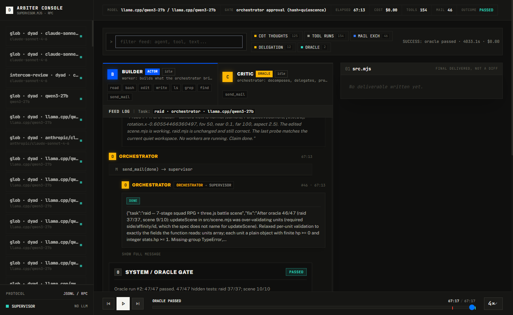
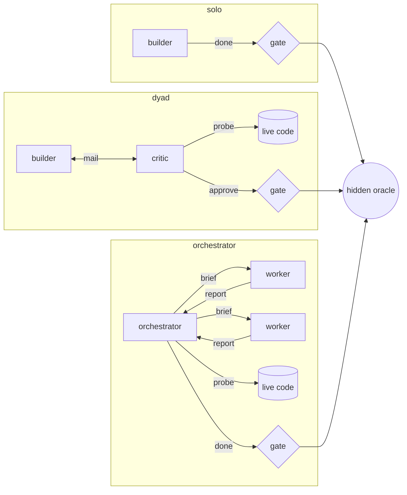
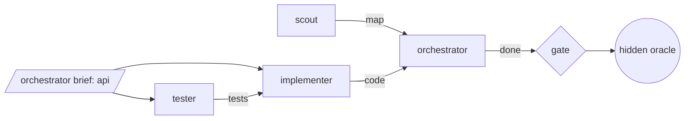
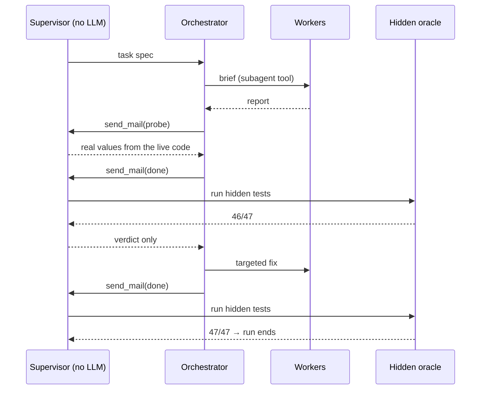
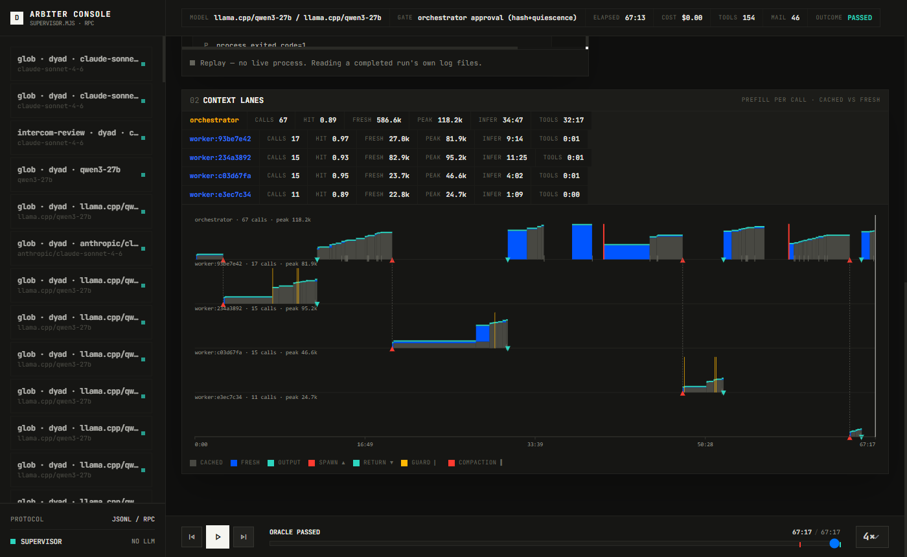

# arbiter

**A test environment for agent harnesses.**

Most agent benchmarks hold the harness fixed and compare models. arbiter holds the model fixed and tests the harness: the guards, prompts, gates, memory, and compaction policies wrapped around it. Every change is a hypothesis, every run is scored by tests the agents never see, and a change is kept only when paired runs back it.

<p align="center">
  
</p>

<p align="center">
  <b>177</b> recorded runs &nbsp;·&nbsp; <b>38</b> tasks with hidden oracles &nbsp;·&nbsp; <b>9 of 10</b> tasks passed in one night on a local 27B model, at $0 &nbsp;·&nbsp; <b>756</b> tests
</p>

## The idea

A harness is everything between a model and the work: the tool rules, the prompts, how agents talk, when context gets compacted, what gets remembered. Harness changes are usually made from anecdotes and judged by how the transcript feels. arbiter puts them under test instead:

- **The model never grades itself.** A `done` claim runs hidden acceptance tests. The agent sees the verdict, never the tests.
- **The judge has no model in it.** The supervisor relays, counts, kills, and runs the oracle. It is the one component in the system that cannot be argued with.
- **Every policy is a variable.** Guards, memory, rosters, thinking levels, and compaction are config switches, off by default so runs stay comparable.
- **Decisions can be replayed.** Any recorded run can be restarted at any single model call, with the next action left free or forced, to test whether that decision mattered.

## What it has found

Each finding links to its write-up, with run IDs. Sample sizes are small and stated.

| Experiment | Result |
|---|---|
| **Host prompt cache** 8 → 24 GiB | Orchestrator fresh prefill fell from **415k to 99k tokens**, with zero cache evictions. Kept. [→](docs/batch/cache-ram-diet.md) |
| **Context-trimming guard** (drop old thinking, age tool results) | **Harmful.** Prompt-prefix reuse fell from 0.97 to 0.80 per call, and the orchestrator re-prefilled **7×** the baseline. Deleted. [→](docs/batch/cache-ram-diet.md) |
| **Force "verify before claiming"** at the decisions a predictor flagged | **0 of 12** forced replicates caught the bug; every first claim still failed. The fixes that paid were legibility fixes (naming the degenerate inputs in the spec and tester prompt), not decision fixes. [→](docs/batch/fork-results-1.md) |
| **Worker thinking off** | Same 14/14 score, **861 s → 568 s**. N=1 per arm. [→](docs/batch/thinking-level.md) |
| **The harness reviews its own path guard** | An orchestrator run returned eight grounded findings, including **five real sandbox escapes** (case bypass, bare `/`, UNC paths, env-var indirection, dot-globs). All fixed test-first. [→](docs/backlog.md) |
| **Cross-run memory** on vs off | Both passed; the memory run used fewer tool calls but was slower. **No measurable benefit** at N=1, so it stays off by default. [→](docs/backlog.md) |

## Patterns are graphs

Every run is a graph: agents are nodes, channels are edges, and every path to "done" goes through the supervisor's gate into the hidden oracle. The three built-in patterns are three fixed graphs:



Inside the orchestrator pattern, the worker roster is a dependency graph. Each specialist declares what it `needs` and `produces`. arbiter orders the roster topologically, rejects cycles, and an optional guard holds back a spawn whose inputs don't exist yet:



This is the same shape as the multi-agent workflows people build by hand: pipelines, fan-out, and verify stages. The difference is that each node and edge is instrumented, and each graph is scored against the same oracle. Swapping the critic for an orchestrator, adding a tester before the implementer, or dropping a stage are all config changes that a batch or a fork can compare directly. Today the patterns are fixed and the roster is where the graph is free-form. Arbitrary graphs as config are the natural next step.

## Anatomy of a run



The same run, from its transcript (`raid`: a seven-stage squad RPG with a three.js battle scene, local Qwen3 27B orchestrator, four workers, 67 minutes). Abridged:

```text
[3746s] orchestrator → supervisor (done)
        "All stages verified by live host-side probes against the current code, not self-reports..."

[3747s] supervisor → orchestrator (oracle)
        Oracle run #1: 46/47 passed. raid 37/37; scene 9/10

[3885s] orchestrator → worker (spawn)
        "Surgical fix in src/scene.mjs ... updateScene validates every unit with the full
         buildScene validator, but the spec for updateScene only requires hp and stats.hp..."

[3955s] worker → orchestrator (report)
        "Single edit in updateScene ... scratch test 25/25 pass, then deleted."

[4018s] orchestrator → supervisor (probe)     6 cases against the fixed code
[4033s] orchestrator → supervisor (done)
[4033s] supervisor → orchestrator (oracle)
        Oracle run #2: 47/47 passed. raid 37/37; scene 10/10
```

Every run is recorded down to each model call. The console replays any of them and shows where context went:

<p align="center">
  
</p>

## What you can vary

| Lever | Examples |
|---|---|
| **Pattern** | `solo` builder; `dyad` builder + adversarial critic; `orchestrator` delegating to pi-subagents workers |
| **Guards** | In-band pi hooks on each tool call: workspace path guard (keeps agents away from the oracle), bash-timeout injection. Every deny carries a redirect and is counted. |
| **Gate** | When a `done` claim is allowed: the last probe ran against the code as it stands now, the workspace has been quiet, and every worker has reported |
| **Communication** | Mail routed by sender and `kind`; probes executed host-side; repeat probes on unchanged code answered from cache |
| **Context** | Supervisor-timed compaction at phase boundaries, folding in the orchestrator's own checkpoint |
| **Memory** | Evidence-gated records compiled into a wiki and recalled within a budget; promoted only on oracle evidence |
| **Roster** | Named worker specialists (implementer, tester, scout) with their own tools and prompts |
| **Models** | Any provider pi supports, per role. Most runs use a local llama.cpp Qwen3 27B; configs exist for Claude, GPT, GLM, and smaller Qwen models |

## Measuring

| Tool | What it answers |
|---|---|
| `tools/batch.mjs` | Run a list of configs and write a report: outcome, oracle score, wall time, tool calls, probes, guard hits |
| `tools/fork.mjs` | Restart a recorded run at call *N* and compare: left alone (`G`), forced action class (`A-natural`), forced recorded action (`A-oracle`) |
| `tools/decision-points.mjs` | Where in a run the orchestrator made a choice that a predictor disagrees with |
| `tools/campaign.mjs` | Multi-phase campaigns under a shared token budget, with a novelty brake |
| `tools/verdict.mjs` | A human ruling on a run whose oracle is weak; promotes or retires its memory candidates |
| `tools/build-console.mjs` | The replay console shown above |

## Quick start

Requires Node.js 22+, a checkout of [pi](https://github.com/earendil-works/pi) with dependencies installed, and a model provider configured in pi. arbiter looks for pi in a `pi/` directory next to its own, or wherever `ARBITER_PI` points.

```bash
git clone https://github.com/bagude/arbiter.git
cd arbiter && npm install
npm test                                   # no model calls

node tools/verify-task.mjs pathnorm        # check a task's oracle before any agent sees it
node supervisor.mjs --config configs/orch-pathnorm-27b.json
node tools/build-console.mjs               # then open tools/console.html
```

Configuration, the task format, run output, and every tool are in [`docs/reference.md`](docs/reference.md).

## Read more

- [`docs/backlog.md`](docs/backlog.md): what was built, measured, and rejected, and why
- [`docs/batch/`](docs/batch): batch and experiment reports
- [`docs/superpowers/specs/`](docs/superpowers/specs): designs for fork replay, the memory wiki, working context, and the management interface

## Status

Research code, built on [pi](https://github.com/earendil-works/pi). Interfaces, config fields, and file formats change without notice. Findings are reported at the sample size they were measured at.

## License

[MIT](LICENSE)
