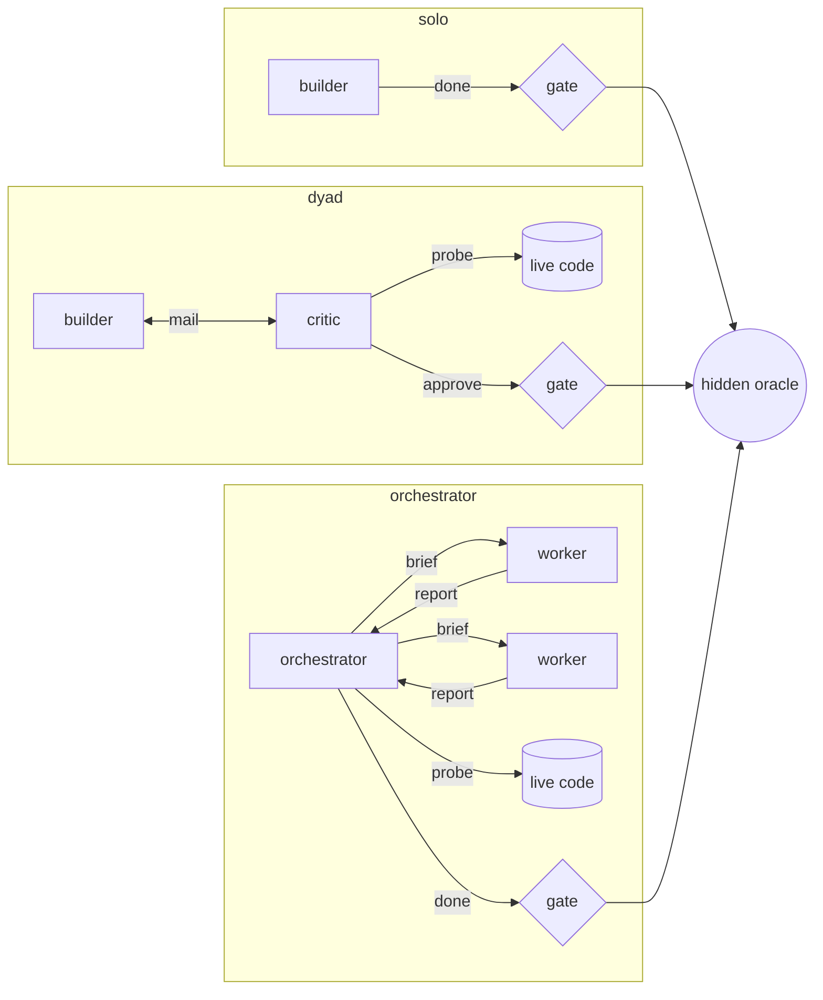
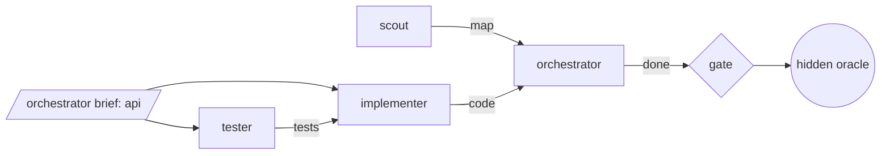

# arbiter

**A test environment for agent harnesses.**

Swap one piece of the harness around a model, whether a guard, a prompt, the agent topology, memory, compaction, or the model itself. Hold everything else fixed and see exactly how the run changes. Every run is scored by hidden tests the agents never see, so "better" means the oracle says so, not that the transcript looks nicer.

<p align="center">
  
</p>

## Why

A harness is everything between a model and the work: which tools it gets and what they may touch, how agents talk to each other, when context is compacted, what is remembered across runs, and who decides that the work is done. These choices move results as much as the model does. They are usually made from anecdotes and judged by feel.

arbiter makes each of them a variable:

- **One change per comparison.** Two configs that differ in one key, run on the same task, against the same oracle.
- **The model never grades itself.** A `done` claim runs hidden acceptance tests. The agent gets the verdict, never the tests.
- **The judge has no model in it.** The supervisor relays, counts, kills, and runs the oracle. It cannot be argued with.
- **Everything is recorded.** Every message, tool call, and model call, with token and cache accounting, so you can see *how* a change moved the result, not just *whether*.

## What you can swap

Each component is a key in the run config. Everything you don't set stays at its default, so two configs that differ in one key are a controlled comparison.

| Component | Config key | Options |
|---|---|---|
| **Topology** | `pattern` | `solo` builder · `dyad` builder + adversarial critic · `orchestrator` delegating to workers |
| **Worker roster** | `workers.use` | Named specialists (`scout`, `tester`, `implementer`), ordered by what each `needs` and `produces` |
| **Models** | `roles.<role>.provider`, `.model` | Any provider pi supports, per role: a local llama.cpp model as orchestrator, a frontier model as worker, or the reverse |
| **Reasoning** | `roles.<role>.thinking` | Thinking level per role |
| **Guards** | `guards.*`, `caps.bashTimeoutSec` | In-band hooks on every tool call. Always on: the workspace path guard and bash timeouts. Opt-in: `call_args`, `result_handles`, `topology`, `pre_spawn_compact` |
| **Context** | `caps.compactAtTokens`, `caps.maxCompactions` | When and how often the supervisor compacts the orchestrator |
| **Memory** | `memory.*` | Off, injected at launch, or searchable, with budgets per role |
| **Budgets** | `caps.*` | Tool calls, wall clock, USD, tokens, `done` attempts |
| **Prompts** | `prompts/`, `roster/` | Role prompts and specialist definitions, as plain Markdown |

Adding a component of your own is a small, contained change. A guard is a policy in `lib/policies/` plus a thin hook in `ext/guards/`. A specialist is one Markdown file in `roster/`. A task is a spec, a starting workspace, and a hidden oracle.

## How you compare

**Swap a component: paired configs.** Copy a config, change one key, and run both:

```diff
  "roles": {
    "orchestrator": { "provider": "llama.cpp", "model": "qwen3-27b" },
-   "worker":       { "provider": "llama.cpp", "model": "qwen3-27b", "max": 1 }
+   "worker":       { "provider": "llama.cpp", "model": "qwen3-27b", "max": 1, "thinking": "off" }
  }
```

```bash
node tools/batch.mjs worker-thinking configs/orch-dw-explore-real-27b.json configs/orch-dw-explore-real-27b-nothink.json
```

The batch report puts the runs side by side: oracle score, wall time, tool calls, probes, `done` attempts, guard hits, and tokens split into cached and fresh. That pair was one of the first comparisons run here. The score held and the run finished about a third faster, so thinking stayed off for that role.

**Swap a decision: fork replay.** Restart a recorded run at a single model call, with its workspace and context exactly as they were, and change only what happens next:

```bash
node tools/fork.mjs <runId> <call> --config <file> --branch G                           # same state, model decides again
node tools/fork.mjs <runId> <call> --config <file> --branch A-natural --action probe    # force the next action class
```

This answers a question a paired run cannot: did *this* choice, at *this* moment, matter? Replicates on each branch show whether a failure came from the state or from the path taken.

**Rule on what the oracle can't see.** Some tasks, such as research or reviews, have only a weak oracle. `tools/verdict.mjs` records a human ruling on a run, so it can still be compared.

## Topology is a graph

Swapping `pattern` swaps the graph of agents. Agents are nodes, channels are edges, and every path to "done" goes through the supervisor's gate into the hidden oracle:



Inside the orchestrator pattern, the roster is a dependency graph of its own. Each specialist declares what it `needs` and `produces`. arbiter orders them topologically, rejects cycles, and a guard can hold back a spawn whose inputs don't exist yet:



This is the shape of the multi-agent workflows people build by hand: pipelines, fan-out, and verify stages. Here each node and edge is instrumented, and each graph is scored against the same oracle, so adding a tester stage or replacing a critic with an orchestrator is a comparison you can run.

## What a run records

Every run writes its own directory: a summary with the oracle score, a readable transcript, the full message bus, each agent's session, and one line per model call. Here is the end of one run's transcript, abridged:

```text
[3746s] orchestrator → supervisor (done)
[3747s] supervisor → orchestrator (oracle)
        Oracle run #1: 46/47 passed. raid 37/37; scene 9/10

[3885s] orchestrator → worker (spawn)
        "Surgical fix in src/scene.mjs ... updateScene validates every unit with the full
         buildScene validator, but the spec for updateScene only requires hp and stats.hp..."
[3955s] worker → orchestrator (report)
        "Single edit in updateScene ... scratch test 25/25 pass, then deleted."

[4018s] orchestrator → supervisor (probe)     6 cases run against the fixed code
[4033s] orchestrator → supervisor (done)
[4033s] supervisor → orchestrator (oracle)
        Oracle run #2: 47/47 passed. raid 37/37; scene 10/10
```

The console replays any run and shows where the context went: prefill per model call for every agent, cached versus fresh, with spawns, returns, guard events, and compactions on one timeline. This is often where the effect of a swap is easiest to see.

<p align="center">
  
</p>

## Quick start

Requires Node.js 22+, a checkout of [pi](https://github.com/earendil-works/pi) with dependencies installed, and a model provider configured in pi. arbiter looks for pi in a `pi/` directory next to its own, or wherever `ARBITER_PI` points.

```bash
git clone https://github.com/bagude/arbiter.git
cd arbiter && npm install
npm test                                   # no model calls

node tools/verify-task.mjs pathnorm        # check a task's oracle before any agent sees it
node supervisor.mjs --config configs/orch-pathnorm-27b.json
node tools/build-console.mjs               # then open tools/console.html
```

The config format, task format, run output, and every tool are in [`docs/reference.md`](docs/reference.md). Design notes and experiment logs are in [`docs/`](docs).

## Status

Research code, built on [pi](https://github.com/earendil-works/pi). Interfaces, config fields, and file formats change without notice.

## License

[MIT](LICENSE)
